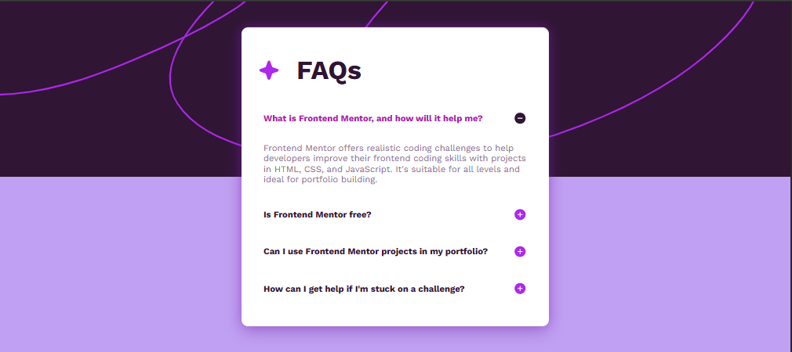

# FAQ Accordion Card

## Overview
This project is a **FAQ Accordion Card** inspired by the Frontend Mentor challenge. It is a responsive accordion component where users can click on questions to reveal answers. The project demonstrates skills in **HTML, CSS, and JavaScript**, including smooth animations and toggle icons.

---

## The Challenge
Users should be able to:

- Click on a question to reveal the corresponding answer.  
- See smooth opening and closing animations.  
- Toggle icons from plus to minus when the question is expanded.  
- View the component on both desktop and mobile layouts.  

---

## Screenshot

### Desktop
  

---

## Links
[Solution URL](https://github.com/fikki008/faq-accordion.git)

[Live Site URL](https://fikki-faq-accordion.netlify.app/)

---

## Features
- Fully **responsive design**  
- Smooth **show/hide animation** for answers  
- Icon toggling between plus and minus  
- Clean and semantic **HTML structure**  
- Works on both **desktop and mobile devices**  

---

## Built With
- HTML5  
- CSS3 (Flexbox, transitions)  
- JavaScript (for accordion toggle functionality)  
- Google Fonts: [Work Sans](https://fonts.google.com/specimen/Work+Sans)  

---

Author

- Your Name – fikki008
- Challenge inspired by Frontend Mentor
